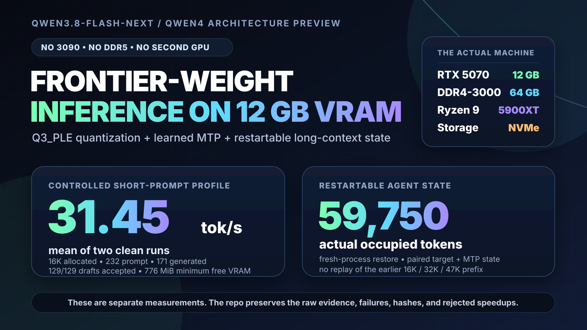
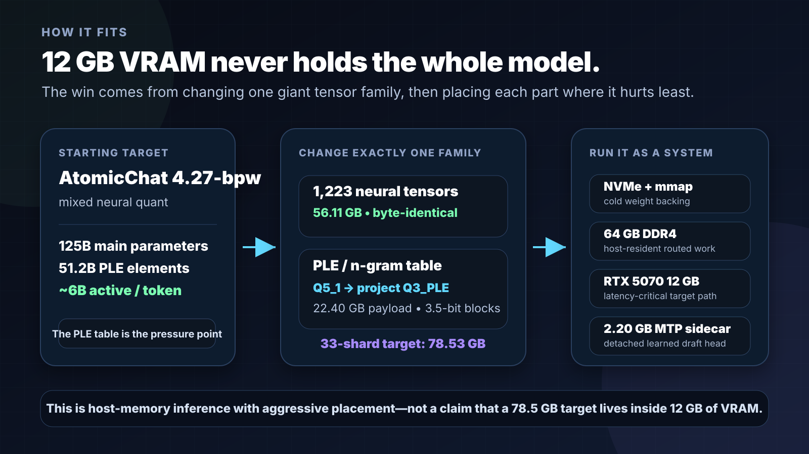
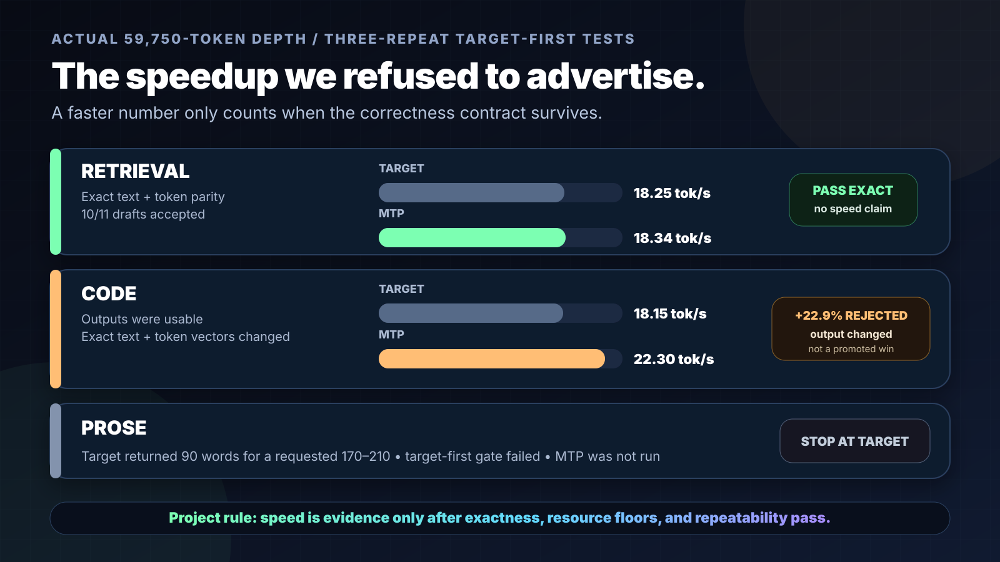

# Qwen3.8-Flash-Next on a 12 GB RTX 5070

**Q3_PLE quantization · learned MTP · restartable long-context state · patched llama.cpp**



This started with a stubborn question:

> Can Qwen's new Qwen4 architecture preview become genuinely useful on the consumer hardware people already own—not a 24 GB 3090 showcase, not a DDR5 workstation, and not a multi-GPU server?

On this machine, the answer became **yes, with clearly measured limits**.

The published configuration runs a 33-shard Q3_PLE target plus a detached learned-MTP sidecar on **one RTX 5070 12 GB, 64 GB DDR4-3000, a Ryzen 9 5900XT, and NVMe storage**. It reached **31.45 tok/s mean sustained decode** on a controlled short-prompt fixture and built a **59,750-token occupied chat state** that survives clean process restarts without replaying the earlier prefix.

**[Read the technical breakdown →](docs/WALKTHROUGH.md)**  
[Hugging Face release page — public after shard verification](https://huggingface.co/nmatteo3294/Qwen3.8-Flash-Next-Q3_PLE-MTP-GGUF) · [Audit the canonical 59,750-token run](docs/community/Q3PLE-CANONICAL-60K-2026-08-31.md) · [Rebuild the exact runtime](patches/llama.cpp/cafe-035e227-to-73b803/README.md)

> [!IMPORTANT]
> **31.45 tok/s and 59,750 occupied tokens are two different results.** The speed headline used a 232-token prompt inside a 16K allocation. The long-context result used a real 59,750-token saved state. This repository keeps them separate everywhere.

## Why this model was worth the grind

Qwen released [Qwen3.8-Flash-Next](https://github.com/QwenLM/Qwen3.8-Flash-Next) on August 26, 2026 as an early preview of the architecture being developed for Qwen4. The official design combines a **125B-parameter main model**, a **51.2B-element n-gram embedding table**, and roughly **6B active parameters per token**.

During release week, [Artificial Analysis scored the base model 56 and ranked it #5 of 111 models](https://artificialanalysis.ai/models/qwen3-8-flash-next) as of August 31, 2026. That is context for why local deployment matters—not a quality claim for this quant. **This project has not yet reproduced the base model's broad capability score on Q3_PLE.**

The work here attacks a different problem: **how far can a frontier-ranked open-weight model be pushed on a small, imperfect, real desktop?**

## The result in plain English

| What was tested | What actually happened | Claim boundary |
| --- | --- | --- |
| Controlled throughput | Two clean 16K-allocation runs averaged **31.4495 tok/s** with a 232-token prompt and 171-token completion | Benchmark profile; only **776 MiB** free VRAM in the tighter run |
| Daily-capacity profile | An **81,920-token allocation** generated at **25.81 tok/s** with the same short prompt | Allocation capacity, **not** 80K occupied-context speed |
| Restartable agent state | A canonical chat state was sealed at **15,872 → 31,700 → 47,303 → 59,750 tokens** | Every later stage started fresh and processed only the unseen suffix |
| Actual-depth retrieval | At 59,750 tokens, target-only measured **18.25 tok/s** and MTP measured **18.34 tok/s** | Exact text/token parity; 10/11 drafts accepted; **no general speedup claimed** |
| Maximum safe allocation tested | **229,376 tokens** initialized and generated at 26.89 tok/s with a 232-token prompt | 262,144 was rejected by the VRAM safety floor |

## How it fits



The important move was **not** requantizing the entire model.

1. Start from AtomicChat's useful 4.27-bpw mixed quant.
2. Preserve the other **1,223 tensor payloads—56,114,183,680 bytes—byte for byte**.
3. Replace only `per_layer_token_embd.weight`, the giant 51.2B-element PLE/n-gram table, with the project Q3_PLE format.
4. Keep learned MTP detached in a **2,202,883,264-byte** sidecar so target and draft experiments remain independently verifiable.
5. Place latency-critical work on the GPU, routed work in host memory, and cold backing on NVMe through mmap.

The resulting target is **33 shards / 78,525,318,176 bytes**. The complete target plus promoted MTP sidecar is **80,728,201,440 bytes**, or about **75.18 GiB**.

This is therefore **a 12 GB GPU deployment**, not a claim that a 78.5 GB target somehow lives inside 12 GB of VRAM.

## The speedup that did *not* make the headline



The project used one rule throughout the final gate:

> **A faster number does not count if exact output changes.**

At 59,750-token depth, the code fixture measured **22.30 tok/s with MTP versus 18.15 tok/s target-only**—a numerical increase of 22.9%. Both answers were usable, but exact text and retokenized-token identity changed in every repeat. The speedup was rejected.

That negative result is public on purpose. Learned MTP is working, but this quantized verifier path is still workload-dependent. Use target-only mode for correctness-sensitive work.

## Pick your path

| You want to… | Start here |
| --- | --- |
| Understand the complete engineering story | **[Technical walkthrough](docs/WALKTHROUGH.md)** |
| See the exact hardware, profiles, and safety floors | [RTX 5070 / 64 GB report](docs/community/Q3PLE-MTP-RTX5070-64GB.md) |
| Audit the real 59,750-token state | [Canonical 60K evidence report](docs/community/Q3PLE-CANONICAL-60K-2026-08-31.md) |
| Reproduce benchmarks | [Benchmark suite](benchmarks/README.md) |
| See the real Pi cache and restart benchmark | [20-turn coding-agent report](docs/community/Q3PLE-PI-AGENT-BENCHMARK-2026-09-02.md) |
| Reconstruct the custom llama.cpp runtime | [Exact 36-patch series](patches/llama.cpp/cafe-035e227-to-73b803/README.md) |
| Inspect provenance and licensing | [Third-party notices](THIRD_PARTY_NOTICES.md) |
| Download and verify the GGUF release after publication | [Hugging Face model repository](https://huggingface.co/nmatteo3294/Qwen3.8-Flash-Next-Q3_PLE-MTP-GGUF) |

## Reproduction quick start

This is an experimental research release, not a stock `llama.cpp` one-liner.

### 1. Rebuild the measured runtime

```powershell
git clone https://github.com/quimmedes/cafe-llama.cpp.git
Set-Location cafe-llama.cpp
git checkout 035e22731a7fd70b9854b3a2d64ec68e9b1a45d3
git am <research-repo>\patches\llama.cpp\cafe-035e227-to-73b803\*.patch
git rev-parse HEAD
```

The patched head must be:

```text
73b803464f25fc9054046728bf2ebed5a372737e
```

The measured Windows build used CUDA 13.1 and SM120a. A build made with another toolchain is a reproduction attempt, not the byte-identical measured binary.

### 2. Download and verify all model files

A complete release contains:

- 33 target GGUF shards;
- 1 learned-MTP sidecar;
- `SHA256SUMS`;
- `target-shards.json`;
- `compatibility.json`;
- provenance and license files.

Do not treat a partial shard set as a usable model. Verify every file before launch.

### 3. Match the profile layout—or edit it deliberately

The supplied profile expects reconstructed runtime and model paths under the repository's ignored `workstreams/` and `artifacts/models/` directories. Either place them there or update [profiles/q3ple_daily_80k.json](profiles/q3ple_daily_80k.json) to your paths while preserving the hashes, placement, safety floors, and one-slot contract.

```powershell
python scripts/q3ple_daily_profile.py validate
python scripts/q3ple_daily_profile.py launch --mode target
```

Experimental MTP mode must be selected explicitly:

```powershell
python scripts/q3ple_daily_profile.py launch --mode mtp
```

Stateful requests require:

```json
{
  "id_slot": 0,
  "cache_prompt": true
}
```

## What is proven

- The complete 33-shard Q3_PLE target loads and generates in the retained patched runtime.
- The promoted target and 2.20 GB learned-MTP sidecar run together.
- The controlled fixture reached **31.45 tok/s mean** with exact preserved output and token hashes.
- Allocations through **229,376 tokens** initialized and generated above the watchdog floors.
- A canonical **59,750-token** target + `.dft` state pair survived fresh-process restores and continued without prefix replay.
- Retrieval at actual depth preserved exact target/MTP text and token parity across three repeats.

## What is *not* proven

- That this quant retains the official base model's full benchmark quality.
- That every 64K–224K allocation can be filled safely on this machine.
- That learned MTP is universally exact or faster.
- That stock llama.cpp can load private Q3_PLE type 43 or reproduce paired MTP state.
- That this runtime is production-ready, crash-atomic, or independently reproduced.
- That the vision path is validated.

## Hardware used

| Component | Measured system |
| --- | --- |
| GPU | NVIDIA RTX 5070, 12 GB |
| CPU | AMD Ryzen 9 5900XT, 16 cores / 32 threads |
| System memory | 64 GB DDR4-3000 |
| Storage | NVMe SSD |
| OS | Windows 11 |
| Runtime | Patched Cafe/llama.cpp lineage, commit `73b803464f25fc9054046728bf2ebed5a372737e` |

## Evidence language

- `MEASURED` — produced locally by a preserved command and raw record on identified hardware and artifacts.
- `PROXY` — an observed surrogate that is not the claimed end metric.
- `ANALYTICAL` — calculated from explicit inputs and assumptions.
- `EXTERNAL` — reported elsewhere and not locally reproduced.
- `VOID` — preserved run whose contamination or incompleteness prevents comparative use.

## Credits and license boundary

This project stands on work from **Qwen**, **AtomicChat**, **llama.cpp**, and **Cafe/Ark**. Historical pinned-host expert-streaming ideas also came from Cafe and FreeToken. The repository does not claim those components as original work.

Original project code and documentation are MIT-licensed under the scoped root [LICENSE](LICENSE). Qwen-derived model weights and GGUF tensors remain subject to the **Qwen Community License 1.0**. Upstream code retains its own notices. See [THIRD_PARTY_NOTICES.md](THIRD_PARTY_NOTICES.md) for the exact boundary.

---

**The headline is speed. The project is really about discipline:** fitting the model, surviving long state, preserving provenance, publishing the failures, and refusing to turn a changed answer into a benchmark win.
