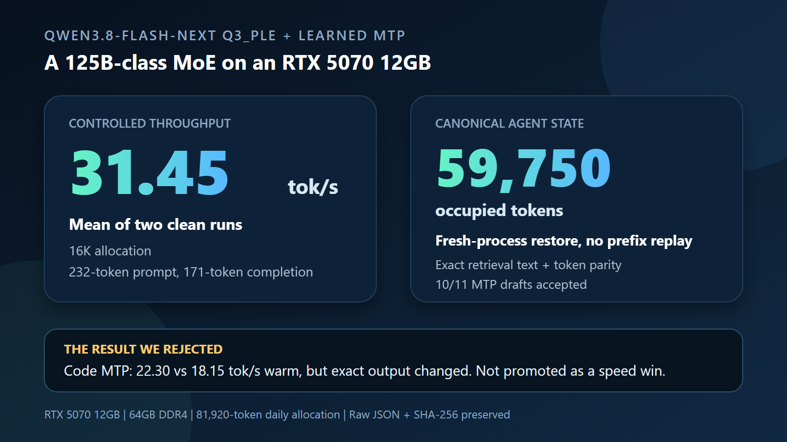

# Qwen3.8-Flash-Next Q3_PLE + Learned MTP

This project studies how far Qwen3.8-Flash-Next can be pushed on one Windows machine with an RTX 5070 12 GB, 64 GB of system RAM, and an NVMe SSD.

The short-prompt headline is **31.45 tok/s mean sustained decode** from two
clean 16K-allocation runs. The harder result is a canonical **59,750-token**
chat state that was built at complete message boundaries, restored across fresh
processes, and extended without replaying the preceding 16K, 32K, or 47K
prefixes. These are different measurements and are kept separate throughout the
repository.

The active lane is now deliberately narrow:

- llama.cpp as the runtime;
- an AtomicChat 4.27-bpw neural quant with the 51.2B-parameter PLE table replaced by the project Q3_PLE format;
- the model's learned MTP head as a detached speculative-decoding sidecar;
- hardware-specific placement of target experts, PLE, KV cache, and draft tensors.

The retired FreeToken experiment and its private model payload were removed on 2026-08-30. The cleanup reclaimed 219.659 GiB of project data, plus 160.70 GiB of unreachable Git staging garbage, while preserving the llama.cpp, Q3_PLE, MTP, and benchmark evidence.

## Current measured result

These are deterministic warm-decode measurements on the same 232-token prompt and 171-token completion. Context above 16K is allocated capacity, not occupied prompt length.

| Allocated context | Placement | Warm decode | Prompt occupancy | Evidence |
| ---: | --- | ---: | ---: | --- |
| 16,384 | n45 | **31.45 t/s mean** | 232 tokens | two measured repeats |
| 65,536 | n47 | **26.45 t/s** | 232 tokens | measured capacity profile |
| 81,920 | n47 | **25.81 t/s** | 232 tokens | measured capacity profile |
| 131,072 | n47 | **27.41 t/s** | 232 tokens | measured capacity profile |
| 196,608 | n48 | **26.65 t/s** | 232 tokens | measured capacity profile |
| 229,376 | n48 | **26.89 t/s** | 232 tokens | measured capacity profile |
| 262,144 | n48 | does not fit safely | not run | failed 768 MiB VRAM floor |

The 16K profile used Q4_0 target KV, n45 target placement, nmax 3 MTP, and a corrected FC/HC sidecar with pinned-host routed experts. Both headline repeats produced exact text and token hashes with 100% draft acceptance. The 80K through 224K rows also generated correctly, but they must not be described as filled long-context performance.

The first monolithic 60K-token occupied-context run failed safely. It reached
59,996 content tokens, crossed the 6 GiB RAM floor, and reset before a valid
completion. We rejected cold replay and replaced it with staged paired-state
persistence. The final canonical build sealed complete assistant-message
boundaries at 15,872, 31,700, 47,303, and 59,750 tokens. Every later stage
started a fresh process, restored the preceding target plus `.dft` pair, and
processed only the unseen suffix.

At actual 59,750-token depth, retrieval preserved exact target/MTP text and
token parity across three repeats while accepting 10 of 11 drafts. Warm decode
was 18.25 tok/s target-only and 18.34 tok/s with MTP. The 0.5% difference is not
presented as a general speedup.

The rejection-bearing code result is intentionally negative evidence: MTP
measured 22.30 tok/s warm versus 18.15 target-only, but changed the exact output
and token vector. We rejected the numerical 22.9% speedup. The prose target also
failed its requested word-count constraint, so that target-first gate stopped
before MTP.

## What is proven and what is not

Proven locally:

- the 33-shard Q3_PLE target loads and generates in the retained llama.cpp fork;
- detached learned-MTP drafting is functional;
- the best short-prompt profile reaches 31.45 t/s mean on this machine;
- allocations through 224K can initialize and generate above the watchdog floors;
- the promoted short-prompt MTP profile matches its preserved expected text and token hashes when every draft is accepted.

Still open:

- broad held-out quality and capability evaluation;
- independent reproduction;
- a general verifier-numerics fix for rejection-bearing MTP workloads;
- upstream integration beyond the published exact runtime patch series.

The promoted-artifact prose A/B is an important negative result: warm decode was 18.85 t/s with MTP versus 18.40 t/s target-only, but the greedy continuation and token hash differed. That is a correctness failure regardless of speed. A separate earlier runtime using a Q4_K_M target and 2.786 GB sidecar produced the often-cited +19.1% code and -18.8% prose rows; those are historical implementation evidence, not measurements of the promoted Q3_PLE configuration. The exact split is recorded in the [MTP provenance boundary](results/QWEN38-MTP-PROTOTYPE-001/PROVENANCE_BOUNDARY_2026-08-30.md). MTP is therefore `PASS_CONDITIONAL`, not a universal speedup and not production-ready.

## Start here

1. [Project decision](DECISION.md)
2. [Full walkthrough](docs/WALKTHROUGH.md)
3. [Canonical 59,750-token report](docs/community/Q3PLE-CANONICAL-60K-2026-08-31.md)
4. [Measured hardware report](docs/community/Q3PLE-MTP-RTX5070-64GB.md)
5. [Benchmark suite](benchmarks/README.md)
6. [Hugging Face model](https://huggingface.co/nmatteo3294/Qwen3.8-Flash-Next-Q3_PLE-MTP-GGUF)
7. [Runtime patch series](patches/llama.cpp/cafe-035e227-to-73b803/README.md)
8. [Open-source decision and license analysis](docs/OPEN_SOURCE_RELEASE.md)

Large model files, build trees, and source worktrees are intentionally excluded
from Git. GitHub contains the walkthrough, exact patch series, source pins,
manifests, selected sealed raw evidence, tests, and limitations. The 33-shard
target and promoted sidecar are distributed separately on Hugging Face under
the Qwen Community License 1.0 boundary.

## Evidence language

- `MEASURED`: produced locally by a preserved command and raw record on identified hardware and artifacts.
- `PROXY`: an observed surrogate that is not the claimed end metric.
- `ANALYTICAL`: calculated from explicit inputs and assumptions.
- `EXTERNAL`: reported elsewhere and not locally reproduced.
- `VOID`: preserved run whose contamination or incompleteness prevents comparative use.

## Attribution and license boundary

The work builds on Qwen3.8-Flash-Next, llama.cpp, AtomicChat's quantized GGUF, and Cafe/Ark MTP work. Historical pinned-host expert-streaming ideas also came from Cafe and FreeToken. The project does not claim those components as original work.

Original project code and documentation are MIT-licensed under the scoped root [LICENSE](LICENSE). Qwen-derived model weights and GGUF tensors remain subject to the Qwen Community License 1.0. llama.cpp and Cafe-derived code retain their MIT notices. See [third-party notices](THIRD_PARTY_NOTICES.md) for the file and artifact boundary.

The public release is an experimental research artifact. It is not stock
llama.cpp compatible, does not establish broad intelligence, and does not claim
a universal MTP speedup.
